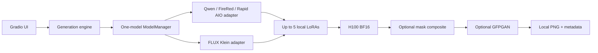

# Architecture

The Gradio UI builds a `GenerationRequest` and passes it to the engine. The engine normalizes images, requests an adapter from the singleton `ModelManager`, applies any selected LoRAs, runs inference, optionally composites a mask and restores faces, then writes results and non-sensitive metadata.

## Memory policy

Adapters load lazily. Selecting a different model unloads the previous pipeline, clears the CUDA allocator, and then loads the next one. Queue concurrency defaults to one. Restoration is separately lazy-loaded. LoRAs are stored on disk and injected only into the active pipeline; changing LoRA selection unloads the previous adapters before loading the new set.

## LoRA library

Uploads are copied into `models/loras/<family>/`. Generation never downloads LoRAs from the Hub. Adapter names are derived from filenames so up to five files can be weighted together with PEFT.

## Privacy

No telemetry or hosted inference is used. Prompts and inputs remain in process memory and are not copied into output metadata. Outputs include reproducibility settings but explicitly record `prompt_stored: false`. Gradio binds to loopback and does not create a share URL by default.

## Compatibility strategy

Recent image-edit pipelines evolve quickly. The shared adapter resolves pipeline classes dynamically and filters keyword arguments against each call signature. Missing classes or snapshots produce actionable errors rather than silently downloading at runtime.
